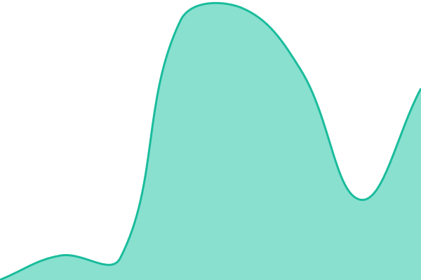
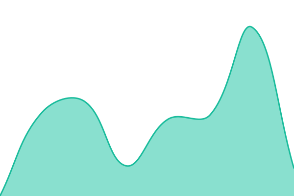
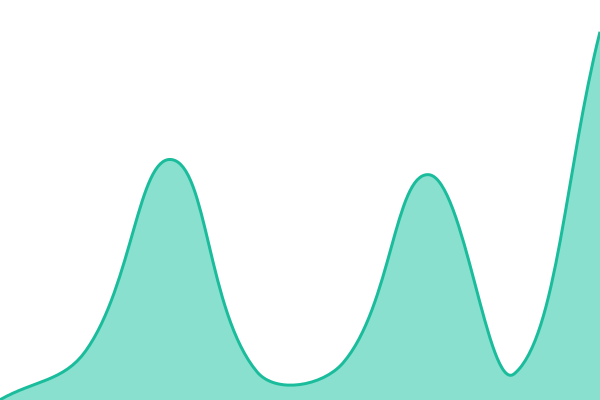

# [📈 Live Status](https://hryjosn.github.io/sleep-on-the-couch-status): <!--live status--> **🟩 All systems operational**

This repository contains the open-source uptime monitor and status page for [Henry Johnson](https://hryjosn.github.io/sleep-on-the-couch-status), powered by [Upptime](https://github.com/upptime/upptime).

With [Upptime](https://upptime.js.org), you can get your own unlimited and free uptime monitor and status page, powered entirely by a GitHub repository. We use [Issues](https://github.com/hryjosn/sleep-on-the-couch-status/issues) as incident reports, [Actions](https://github.com/hryjosn/sleep-on-the-couch-status/actions) as uptime monitors, and [Pages](https://hryjosn.github.io/sleep-on-the-couch-status) for the status page.

<!--start: status pages-->
<!-- This summary is generated by Upptime (https://github.com/upptime/upptime) -->
<!-- Do not edit this manually, your changes will be overwritten -->
<!-- prettier-ignore -->
| URL | Status | History | Response Time | Uptime |
| --- | ------ | ------- | ------------- | ------ |
|  [今晚睡沙發？首頁](https://sleep-on-the-couch.lol/) | 🟩 Up | [今晚睡沙發-首頁.yml](https://github.com/hryjosn/sleep-on-the-couch-status/commits/HEAD/history/今晚睡沙發-首頁.yml) | 

 767ms
     
 | 

<a href="https://hryjosn.github.io/sleep-on-the-couch-status/history/今晚睡沙發-首頁">100.00%</a>
    

|  [ads.txt](https://sleep-on-the-couch.lol/ads.txt) | 🟩 Up | [ads-txt.yml](https://github.com/hryjosn/sleep-on-the-couch-status/commits/HEAD/history/ads-txt.yml) | 

 574ms
     
 | 

<a href="https://hryjosn.github.io/sleep-on-the-couch-status/history/ads-txt">97.98%</a>
    

|  [結算頁](https://sleep-on-the-couch.lol/result) | 🟩 Up | [結算頁.yml](https://github.com/hryjosn/sleep-on-the-couch-status/commits/HEAD/history/結算頁.yml) | 

 408ms
     
 | 

<a href="https://hryjosn.github.io/sleep-on-the-couch-status/history/結算頁">100.00%</a>
    

<!--end: status pages-->

[**Visit our status website →**](https://hryjosn.github.io/sleep-on-the-couch-status)

## 📄 License

- Powered by: [Upptime](https://github.com/upptime/upptime)
- Code: [MIT](./LICENSE) © [Anand Chowdhary](https://anandchowdhary.com)
- Data in the `./history` directory: [Open Database License](https://opendatacommons.org/licenses/odbl/1-0/)
